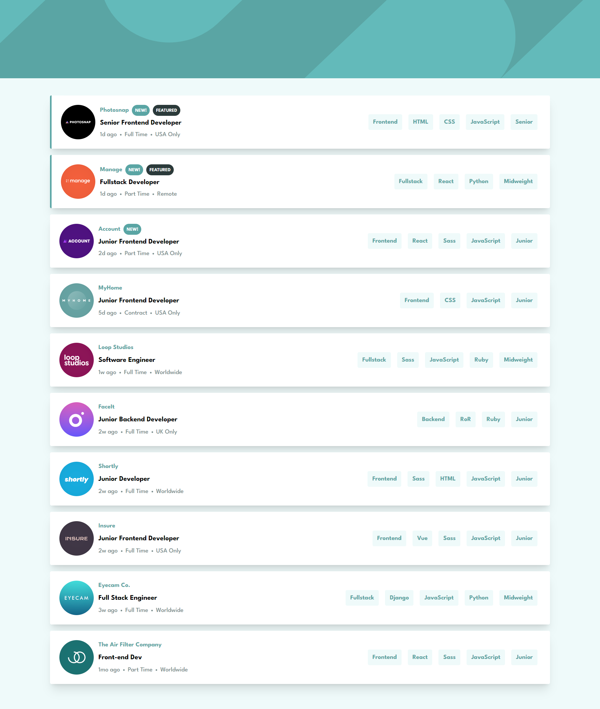
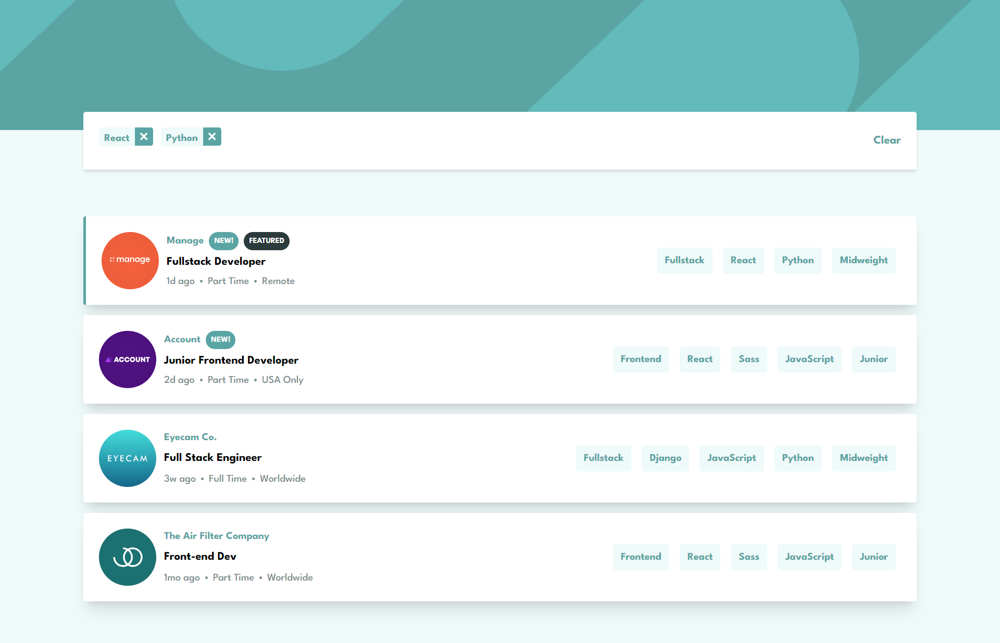
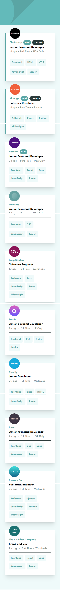
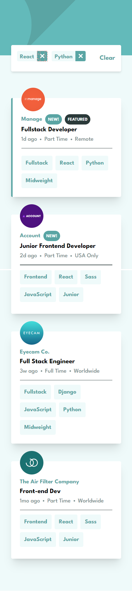

# Frontend Mentor - Job listings with filtering solution

This is a solution to the [Job listings with filtering challenge on Frontend Mentor](https://www.frontendmentor.io/challenges/job-listings-with-filtering-ivstIPCt).

## Table of contents

- [Overview](#overview)
  - [The challenge](#the-challenge)
  - [Screenshot](#screenshot)
  - [Links](#links)
- [My process](#my-process)
  - [Built with](#built-with)
- [Author](#author)

## Overview

### The challenge

Users are able to:

- View the optimal layout for the site depending on their device's screen size
- See hover states for all interactive elements on the page
- Filter job listings based on the categories

### Screenshot

##### Desktop

##### Mobile

### Links

- Solution URL: [https://jobs-listing-filtering.netlify.app/](https://jobs-listing-filtering.netlify.app/)

## My process

### Built with

- Semantic HTML5 markup
- [TailwindCSS](https://tailwindcss.com/)
- [React](https://reactjs.org/)
- [Vite](https://vitejs.dev/)

## Author

- Website - [Ana Tripunoska](https://atripunoska.github.io/)
- Frontend Mentor - [@atripunoska](https://www.frontendmentor.io/profile/atripunoska)
